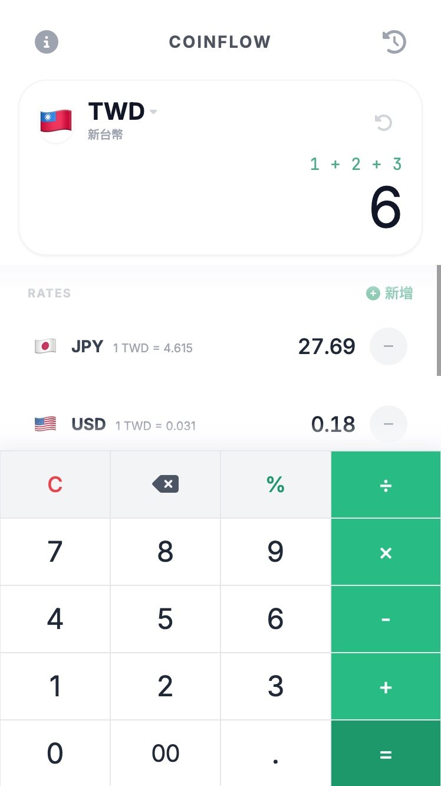

# WAYFARER — 旅行者匯率計算機

專為旅行者設計的極簡 PWA 匯率計算機。支援多國法幣與主流加密貨幣的即時換算，可安裝至手機桌面，完整支援離線使用。



---

## 功能特色

**匯率換算**
- 支援 170+ 國法幣即時換算
- 支援 15 種主流加密貨幣（BTC、ETH、SOL 等）
- 可切換主貨幣，同時顯示多個目標幣種
- 匯率每日自動更新

**計算輸入**
- 支援四則運算式輸入（例如：`1200 + 800 × 3`）
- 運算式累加顯示，方便多筆金額加總
- 一鍵複製換算結果

**離線支援**
- 安裝為 PWA 後，即使無網路也可正常使用
- 離線時自動使用最近一次快取的匯率
- Header 顯示離線狀態與快取資料提示
- 有新版本時自動提示重新載入

**其他**
- 深色／淺色模式自動切換
- 換算歷史紀錄，支援一鍵復用
- 響應式設計，最佳化行動裝置體驗

---

## 安裝為 PWA

### iOS（Safari）
1. 用 Safari 開啟本站
2. 點下方分享按鈕
3. 選「加入主畫面」

### Android（Chrome）
1. 用 Chrome 開啟本站
2. 點右上角選單
3. 選「新增至主畫面」或「安裝應用程式」

安裝後即可離線使用，匯率資料會在有網路時自動更新。

---

## 本機開發

此專案為純靜態網站，無需安裝任何套件。

```bash
# 克隆專案
git clone <repo-url>
cd coinflow

# 啟動本機伺服器（需要從上層目錄啟動，以符合 /coinflow/ 路徑）
python3 -m http.server 8080 --directory .

# 開啟瀏覽器
open http://localhost:8080/docs/
```

> **注意**：Service Worker 需要在 `http://localhost` 或 HTTPS 環境下才能運作。

---

## 技術架構

| 項目 | 技術 |
|------|------|
| 前端框架 | Vue 3（CDN 模式，自架） |
| 樣式 | Tailwind CSS（自架） |
| 計算引擎 | math.js、currency.js |
| 圖示 | Font Awesome 6（自架） |
| 離線支援 | Service Worker + Cache API |
| 部署 | GitHub Pages |
| 自動化 | GitHub Actions |

所有第三方函式庫均已下載至 `docs/libs/`，確保離線環境可完整運作，不依賴外部 CDN。

---

## 匯率更新機制

透過 GitHub Actions 自動排程：

- **每日** 自動抓取最新法幣與加密貨幣匯率並 commit 更新
- **Push 觸發**：僅部署，不更新匯率
- **手動觸發**：可從 Actions 頁面選擇是否同時更新匯率
- 若所有來源 API 均失敗，會自動建立 Issue 通知

---

## 目錄結構

```
coinflow/
├── docs/                  # GitHub Pages 根目錄
│   ├── index.html         # 主應用程式（Vue 3 SPA）
│   ├── sw.js              # Service Worker（離線快取）
│   ├── manifest.json      # PWA Manifest
│   ├── rates.json         # 法幣匯率資料（自動更新）
│   ├── crypto-rates.json  # 加密貨幣匯率資料（自動更新）
│   ├── currencies.json    # 法幣清單與中文名稱
│   ├── crypto-currencies.json  # 加密貨幣清單
│   ├── icons/             # PWA 圖示
│   └── libs/              # 自架第三方函式庫
│       ├── vue/
│       ├── tailwind/
│       ├── currency/
│       ├── mathjs/
│       └── fontawesome/
└── .github/workflows/     # CI/CD 自動化設定
```

---

## 注意事項

- 本工具提供的匯率資料僅供參考，不應作為金融交易依據
- 離線時顯示的匯率為最近一次更新的快取資料，可能與實際匯率有落差
